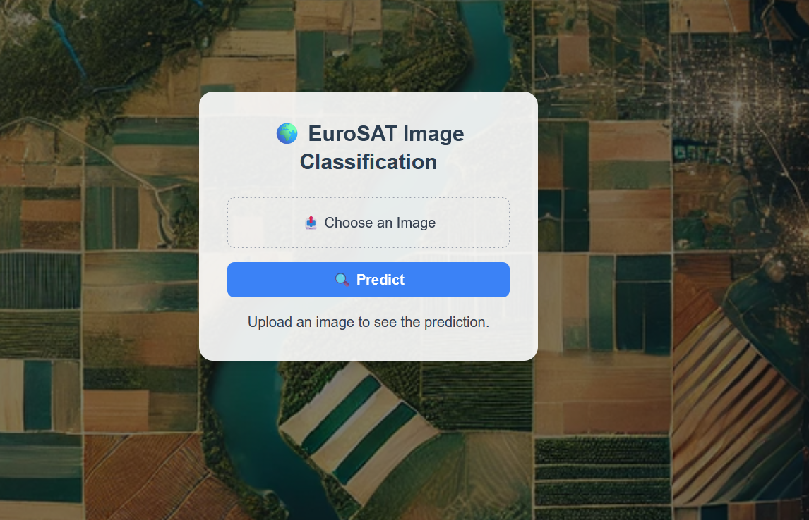

# EuroSAT Land Type Classification

This repository contains a Flask-based web application for classifying land types using a pre-trained deep learning model. The application uses the ResNet-50 architecture and is trained on the EuroSAT dataset, which contains satellite imagery representing different types of land use.

## Overview
The goal of this project is to provide an easy-to-use interface where users can upload satellite images and receive a classification prediction indicating the type of land use (e.g., forest, residential, river, agricultural land). The application demonstrates the use of deep learning for geospatial image analysis and computer vision tasks.

## Key Features
- Upload satellite images and automatically classify their land type.
- Utilizes a pre-trained (**ResNet-50**) convolutional neural network for robust and accurate predictions.
- Displays both the (**predicted land class**) and the model’s confidence score.
- Includes a simple and responsive (**Flask web interface.**)

## Dataset
The model is trained on the EuroSAT dataset, which consists of 27,000 labeled and georeferenced images covering 10 classes:

    Annual Crop

    Forest

    Herbaceous Vegetation

    Highway

    Industrial

    Pasture

    Permanent Crop

    Residential

    River

    Sea/Lake
    
## Screenshot of the Deployment


## Installation & Setup

**Clone the repository**  
   ```bash
   git clone https://github.com/OmarAli141/Land_Type_Classification.git
   cd Land_Type_Classification
